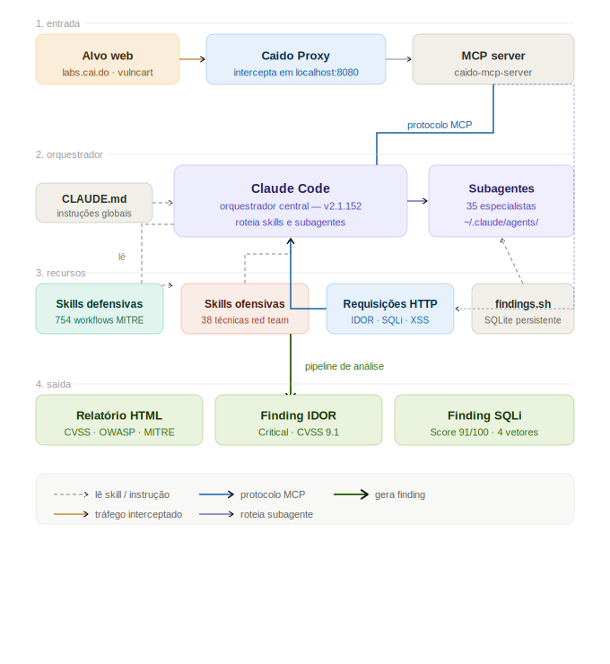

<div align="center">



# 🛡️ Pentest AI Lab

**Do alvo ao relatório em minutos.**

Claude Code + Caido MCP + 792 Skills + 35 Subagentes de IA — um ambiente completo de pentest assistido por inteligência artificial para analistas que trabalham sozinhos ou prestam serviços.

[](https://ubuntu.com)
[](https://github.com/anthropics/claude-code)
[](https://github.com/c0tton-fluff/caido-mcp-server)
[](https://github.com/mukul975/Anthropic-Cybersecurity-Skills)
[](https://github.com/0xSteph/pentest-ai-agents)
[](LICENSE)

</div>

---

## O que é isso?

Um ambiente de pentest assistido por IA que integra cinco componentes em um pipeline coerente:

| Componente | Função |
|---|---|
| **Claude Code** | Orquestrador central — interpreta pedidos em linguagem natural e roteia para skills ou subagentes |
| **Caido Proxy** | Intercepta e armazena tráfego HTTP/HTTPS do alvo em `localhost:8080` |
| **Caido MCP Server v4.0** | Ponte entre Claude Code e Caido — 64 ferramentas MCP + resources |
| **Skills (792)** | 754 defensivas + 38 ofensivas — workflows MITRE para qualquer vetor |
| **Subagentes (35)** | Especialistas autônomos — Tier 2 executa sqlmap, ffuf, nuclei com sua aprovação |
| **findings.sh** | Banco SQLite que persiste vulnerabilidades por cliente entre sessões |

**Não é autopilot.** Você mantém o controle — o ambiente executa o trabalho repetitivo enquanto você decide o que investigar.

---

## Resultado real

> Sessão realizada em `labs.cai.do` com o ambiente descrito neste repositório.

### Cadeia de ataque — Score 91/100 em < 15 minutos

```
IDOR /idor.php
  └─ expõe schema + user_ids sequenciais
       ↓
SQLi /sqlInjection.php (SQLite 3.46.1)
  └─ UNION SELECT bypass Cloudflare WAF
  └─ dump completo: users + api_keys + credenciais plaintext
       ↓
Role Escalation /matchAndReplace.php
  └─ api_key=ak_admin_SECRET_KEY_999 → acesso admin sem credenciais
       ↓
XSS /xss.php
  └─ sequestro de sessão de qualquer usuário autenticado
```

**exploit-chainer** correlacionou os 4 vetores automaticamente e montou o caminho de maior impacto.

### SSTI Twig 3.22.1 — 62 tool uses, 27 minutos

| Payload | Resultado |
|---|---|
| `{{7*7}}` | `49` — avaliação server-side confirmada |
| `{{server\|json_encode}}` | IP interno `10.29.64.230`, `DOCUMENT_ROOT`, Apache 2.4.65 |
| `{{phpinfo()}}` | PHP 8.4.15, endpoints Kubernetes `10.221.0.1:443`, env vars Render.com |
| RCE OS | Bloqueado — sandbox + `disable_functions`. Vetores residuais: SSRF K8s, `SQLite3::loadExtension` |

**web-hunter** (agente Tier 2) executou o workflow completo de bypass de sandbox autonomamente.

---

## Como funciona na prática

Você descreve a tarefa em linguagem natural. O Claude roteia para o especialista correto:

```
# Exemplo 1 — mapeamento de superfície
"Meu escopo autorizado é labs.cai.do.
Preciso mapear todos os endpoints disponíveis e identificar vetores de ataque."

→ recon-advisor executa automaticamente
→ retorna tabela de endpoints com vetores identificados via Caido MCP
```

```
# Exemplo 2 — exploração com agente Tier 2
"Usando o MCP do Caido, busca os detalhes da requisição ID 434 (GET /ssti.php).
Com os dados obtidos, use o agente web-hunter com a skill offensive-ssti
para executar o workflow completo de SSTI contra o Twig 3.22.1 com sandbox ativo."

→ web-hunter executa 62 tool uses em 27 minutos
→ finding registrado no banco com CVSS e evidências
```

```
# Exemplo 3 — encadeamento
"Use o agente exploit-chainer para correlacionar todos os vetores encontrados
em labs.cai.do e montar o caminho de maior impacto."

→ exploit-chainer correlaciona automaticamente
→ cadeia documentada com score, steps e mapeamento MITRE ATT&CK
```

---

## Skills vs Subagentes

Dois modos de operação para situações diferentes:

| | Skills | Subagentes |
|---|---|---|
| **Ativação** | Você menciona explicitamente | Linguagem natural — Claude roteia automático |
| **Execução** | Claude lê workflow e orienta | Agente roda de forma autônoma |
| **Ferramentas** | Orientação metodológica | Tier 2 executa sqlmap, ffuf, nuclei de verdade |
| **Ideal para** | Análise guiada, aprendizado | Execução real, volume alto |

Você pode usar os dois na mesma sessão.

---

## Findings persistentes por cliente

```bash
# Criar engajamento por cliente
findings.sh init cliente-a --client "Cliente A" --type web --scope "app.clientea.com.br"
findings.sh init mpms-2026 --client "GOV"     --type web --scope "*.qualquerorgao.gov.br"

# Alternar entre clientes
export PENTEST_AI_ENGAGEMENT="cliente-a"
findings.sh stats

# Agentes Tier 2 gravam automaticamente quando o engajamento está ativo
# Tudo persiste em ~/.pentest-ai/findings.db entre sessões
```

---

## Stack

| Componente | Versão | Tipo |
|---|---|---|
| Claude Code | v2.1.152 | Pago — Pro/Team |
| Caido Proxy | v0.56.2 | Free tier |
| Caido MCP Server | v4.0.0 (64 tools) | Open source |
| Skills defensivas | 754 workflows | Open source |
| Skills ofensivas | 38 técnicas | Open source |
| Subagentes | 35 especialistas | Open source |
| Sistema operacional | Ubuntu 24.04 LTS | — |

O único custo recorrente é o Claude Pro/Team (~$20-25/mês). Todo o resto é gratuito.

---

## O que está neste repositório

```
pentest-ai-lab/
├── README.md             # este arquivo
├── QUICKSTART.md         # primeiros passos (pré-requisitos + Claude Code)
├── architecture/
│   └── diagram.svg       # diagrama de arquitetura do ecossistema
├── demo/
│   ├── idor-chain.png    # cadeia IDOR+SQLi+XSS score 91/100
│   └── ssti-twig.png     # SSTI Twig sandbox 27min
├── presentation/
│   └── pentest-ai-lab.pdf  # apresentação do projeto
└── LICENSE
```

---

## 📦 Guia completo de instalação

O guia completo está disponível sob solicitação. Ele inclui:

- ✅ 15 capítulos com sequência validada do zero ao ambiente funcional
- ✅ Instalação completa no Ubuntu 24.04 LTS com comandos exatos
- ✅ Configuração do Caido Proxy, certificado CA e interceptação HTTPS
- ✅ findings.sh com múltiplos clientes e persistência entre sessões
- ✅ Capítulo de atualização do Caido MCP Server sem quebrar o ambiente
- ✅ Troubleshooting com os erros reais que aparecem durante a configuração
- ✅ Prompts validados para cada tipo de engajamento

**Para receber o guia, entre em contato:**

- 💼 [LinkedIn — Joabe Kachorroski](https://www.linkedin.com/in/joabekachorroski)
- 🐛 Ou clique aqui [Caido AI Driven](https://caidoaidriven.com/) e **"adquira o guia completo."**

---

## Começar pelo QUICKSTART

Se quiser explorar antes de entrar em contato, o [`QUICKSTART.md`](QUICKSTART.md) cobre os primeiros passos — contas necessárias, pré-requisitos e instalação do Claude Code.

---

## Aviso legal

Este ambiente é desenvolvido **exclusivamente para uso em ambientes autorizados** — pentest contratado, bug bounty em programas válidos, CTFs e laboratórios próprios.

O uso em sistemas sem autorização explícita é ilegal e de responsabilidade exclusiva do usuário.

---

<div align="center">

**O mesmo analista. Dez vezes mais capacidade.**

*Desenvolvido e validado por [Joabe Kachorroski](https://kachorroskicyber.com/) — Senior Cybersecurity Specialist, MPMS*

</div>
